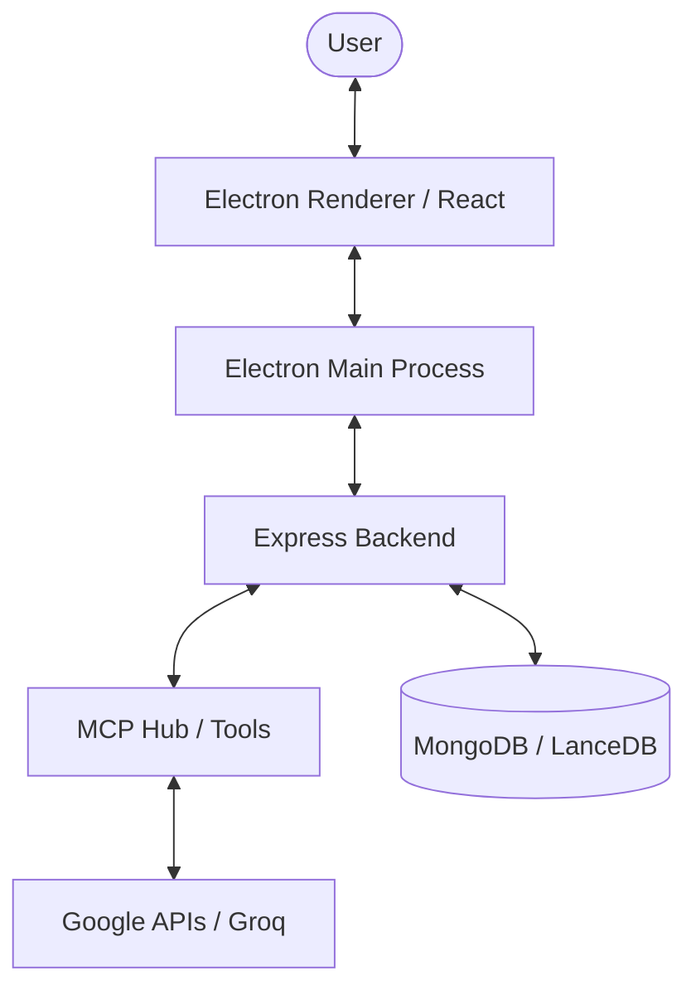

# Cortex (MCP) 🚀

Cortex is a powerful, production-ready AI workspace assistant built on the **Model Context Protocol (MCP)**. It integrates your Google Workspace (Calendar, Gmail, Drive) and a local AI Browser into a unified Electron-based desktop application.


## ✨ key Features

### 🧠 Intelligent Workspace
- **Google Workspace Integration**: Seamlessly manage Gmail, Calendar, and Contacts using natural language.
- **Smart Reminders**: Set and track tasks with LLM-powered context awareness.
- **History & Memory**: Persistent chat history and vector-based memory for long-term context.

### 🌐 AI Browser Capabilities
- **Autonomous Browsing**: Navigate the web, click elements, and extract information.
- **Interactive UI**: View a side-by-side browser workspace while chatting.
- **Cross-Service Workflows**: Combine web data with workspace actions (e.g., "Find a flight and add it to my calendar").

### 🖥️ Desktop Experience
- **Electron Powered**: A native desktop app experience for Windows/macOS/Linux.
- **Multi-Tab Support**: Manage multiple browsing tasks simultaneously.
- **Theme-Aware**: Fully responsive design with Dark/Light mode support.

## 🛠️ Technical Stack

- **Frontend**: React (Vite), Tailwind CSS, Lucide Icons, Electron (Renderer).
- **Backend/Middle**: Express (Node.js), Electron (Main), MongoDB (Persistence), LanceDB (Vector Search).
- **AI Core**: Groq SDK (Llama 3.1 70B), MCP Hub (Custom Tools).
- **Integration**: Google Cloud Console (OAuth2, Workspace APIs).

## 📂 Architecture Overview



*For a detailed breakdown, see [Architecture documentation](docs/Architecture.md).*

## 🚀 Quick Start

### Prerequisites
- Node.js (v18+)
- MongoDB & LanceDB
- Google Cloud Project Credentials
- Groq API Key

### Installation

1. **Clone & Setup**:
   ```bash
   git clone <repo-url>
   cd mcp-chatbot
   ```

2. **Backend**:
   ```bash
   cd server
   npm install
   cp .env.example .env # Configure variables
   npm run dev
   ```

3. **Frontend (Desktop)**:
   ```bash
   cd client
   npm install
   npm run electron:dev
   ```

## 📖 Documentation

- [Setup Guide](docs/Setup.md) - Detailed environment and API configuration.
- [Feature Details](docs/Features.md) - Deep dive into tools and integrations.
- [Architecture](docs/Architecture.md) - Technical design and data flow.
- [CONTRIBUTING.md](CONTRIBUTING.md) - How to add new MCP tools.

## 🔒 Security
Cortex uses Google OAuth2 for secure workspace access. Sessions are managed locally, and sensitive API keys are stored in environment variables.

---
*Built with ❤️ for the Advanced Agentic Coding community.*
