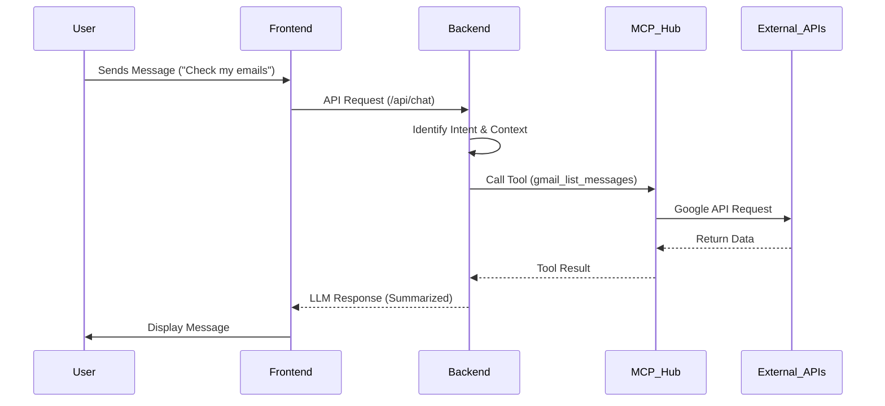

# Architecture Documentation 🏗️

Cortex is built on a distributed agentic architecture that leverages the Model Context Protocol (MCP) to bridge the gap between Large Language Models and local/remote tools.

## System Overview

### 1. Unified Desktop Shell (Electron)
- **Main Process**: Manages application lifecycle, window management, and acts as a bridge between the frontend and the local backend.
- **Renderer Process**: Runs the React-based user interface, handling user interactions and displaying the chat and browser workspace.

### 2. Express Backend
- Acts as the central orchestrator.
- Manages authentication via Google OAuth2.
- Handles chat persistence (MongoDB) and vector memory (LanceDB).
- Interfaces with the **MCP Hub**.

### 3. MCP Hub & Tool Infrastructure
- **Server-side Tools**: Custom implementations for Google Workspace (Gmail, Calendar, Drive).
- **Client-side Tools**: The AI Browser integration, allowing the LLM to interact with the web via the Electron main process.
- **Dynamic Discovery**: Supports runtime discovery of new MCP servers.

## Data Flow

## Storage Layer
- **MongoDB**: Stores user profiles, chat sessions, and message history.
- **LanceDB**: Local vector database used for storing and retrieving relevant context snippets (Long-term Memory).
- **Local Filesystem**: Used for logging and temporary assets.
